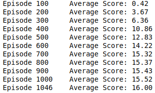
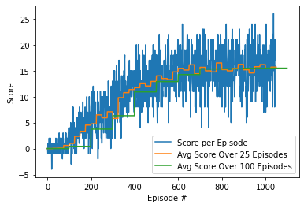
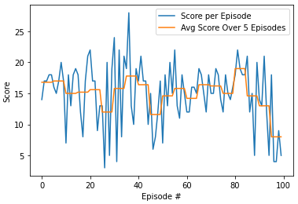

# Report Project 1 - Navigation

### 
Miguel Carreira Neves

22/03/2022

---

## **Learning Algorithm**

To solve this project an algorithm was implemented based on the original Deep Q Learning **TODO - insert ref** with some variations and improvements.

The network description itself along with the agent details, interpretation of obtained results and possible future work ideas are described in sections ahead.
  

## Q Network

The trained network has a layout of two Fully Connected layers of 64 nodes each followed by another Fully Connected layer of 4 nodes, equal to the number of actions since it is the output layer.

Training was done using a CPU only since the network only has Fully Connected layers so it would not benefit from any paralelism, thus the GPU would probably not significantly decrease training time.  

## Agent

The Agent interacts with and learns from the environment.

It is given an initial state and decides which action is the best, then it observes which state derives from taking that action and gets the respective reward which is added to the score for that episode. Epsilon is updated each episode based on the hyperparameters.

These steps are repeated until the episode has finished. 

If the agent scores an average over 100 episodes equal or greater to the score goal it saves the network weights in a file called `checkpoint.pth`.

### Agent Behaviours

`act(self, state, eps=0.)`

The local Q Network is changed to evaluation mode based on the current state an action is choosen based the current policy using a epsilon greedy aproach.

`step(self, state, action, reward, next_state, done)`

It performs a step, potentially a learning step. An experience is saved into the Replay Memory and if enough steps have passed (based on a hyperparameter) the agent replays a random experience from memory and learns from it.

`learn(self, experiences, gamma)`

Changes local network to train mode and updates value parameters using a given batch of experience tuples (replay memory) and a discount factor.

It calculates the predicted maximum Q values for each next state using the target network and then uses these calculated values to find the value for each current state. 

Then the expected Q values for each state are also retrieved using the local network and the loss between the Q values of the local and the target is calculated (using the mean squared error).

This loss is then used for the backpropagation step along with the optimizer. 

Finally the network is updated using a soft update.

`soft_update(self, local_model, target_model, tau)`

Updates both the local and the target networks weights depending on the value of the hyperparameter tau.

### Implementation Details

- Replay Memory 

The replay buffer contains a collection of past experience tuples (state,action,reward,next state,done).

The act of sampling a small batch of tuples from the replay buffer in order to learn is known as experience replay.

In addition to breaking harmful correlations, experience replay allows us to learn more from individual tuples multiple times, recall rare occurrences, and in general make better use of our experience.

- Target Network

In Q-Learning, we update a guess with a guess, and this can potentially lead to harmful correlations.

To avoid this, we can update the weights in the network by predicting the values of the next states using a target network (different from the local network) and then calculating the loss using the mean squared average between these values and the values the local network expects. 

This loss is then used for the backpropagation step.

The target network is similar to the local network with the only difference being that the target network updates itself in a more slow and stable way than the local network (how slow/stable is controlled by tau's value).

This is done with the intent of the target being as stable as possible and to avoid problems derived from trying to chase a moving target.

- Optimizer

Adam Optimizer is used for the backpropagation step and gradient descent, this is one of the most used optimizers since it generates good results almost always.

---

## Hyperparameters Values

*Agent*

- Replay Buffer Size: 1e5
- Minibatch Size: 64
- Discount Factor Gamma: 0.99 
- Tau: 1e-3         
- Learning Rate: 5e-4            
- Steps To Update Network: 4 

*DQN*

- Number of Episodes To Train: 2e3
- Maximum Timesteps Per Episode: 1e3
- Initial Epsilon: 1
- Minimum Epsilon: 0.01
- Epsilon Decay; 0.995
- Score Goal: 13

---

## **Results**

### Training 

If the model is training and achieves its objective of having a average score of 13 on 100 episodes its weights will be saved to a file `checkpoint.pth` which then can be used to test the network and see it perform in test mode.

Example of the model training and its score over the episodes and achieving its goal. 

Notice that the enviroment is considered solved 100 episodes before it achieves the average score of 13 over 100 episodes.

And then we can see its score over episodes plotted. The score takes about ~400-500 episodes to reach the goal average score of 13 on 100 episodes.

It is also noticable that it peaks at around 16 average over 100 episodes when we train on about 1000 episodes. 

When we reach the 800 episodes mark average score improvement slows down massively.

We can see that it's score has a high variance which shows how inconsistent it is.

### Testing

A unity window will pop up and the agent will try to maximise its score, doing it in normal speed instead of the accelerated speed (for training), the window is also larger. 

The agent can be seen to always follow Yellow Bananas while avoiding Blue ones in a mostly intelligent way. However sometimes it can be seen to act in an unnatural way, constanly changing directions and having no consistent movement.

Below is an example of the model performing after being trained on around 1000 episodes and its attained score over 100 episodes.

Just like in training the score over episodes is very insconsistent, reaching a maximum of 28 and a minimum of 3 with an average of about 16.

---

## **Future Work**

Possible modifications, experimentations or additions which could be made and explored to further try to improve our agent behaviour and consistency.

### Q Network

- Number of Layer and Nodes Variations

Experimentation with different number of layers/nodes in each layer could be made to try to create either a more powerfull or a lighter and simpler network. A more powerfull network (with more layers and nodes) would need more training time and the oposite for a lighter one.

- Input Pixels

The network could be changed to have convolutional layers to take as an input the enviroment pixels (which might need preprocessing such as grayscale, etc.) instead of in-game data.

In this scenario training with a GPU would be strongly recommended since convolutional layers take a lot of computation power and they can be heavily optimized using paralelism which the strong suit of the GPU.

### Learning Algorithm

- Prioritized Experience Replay - 

To deal with the huge variation in the obtained score by the model both when training and when testing a technique called Replay Priority could be enforced.

This technique replays some experiences with a higher priority, for example in the cases where they led to great results or to horrible ones, so as to replay important experiences more frequently, and therefore learn more efficiently and make less mistakes. This should probably help to reduce the variance in the attained score by the network, making it more consistent. 

- Saving the Replay Memory

In addition to the weights of the network being saved when it achieves the desired score goal, the replay memory itself could also be saved to allow for further training of a previous network using its past experiences in addition to new ones.

- DDQN (Double Deep Q Network)

Double Q-learning can make estimation more robust by selecting the best action using one set of parameters *W*, but evaluating it using a different set of parameters *W'*. Since we already have a second network (the target network), this implementation would not be to difficult, neither would it weight significantly more computationally.

### Hyperparameter Values

These values were choosen based on what the scientific community usually agrees are the best, however they can be changed using trial and error to improve model performance and decrease training time.