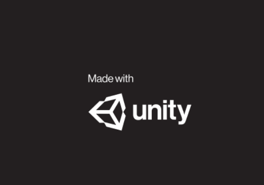

# Udacity Deep RL Nanodegree Project 2 - Continuous Control

### <p style="text-align: center;">Miguel Carreira Neves</p>
<p style="text-align: center;">17/04/2022</p>

---

## Project Details

This project was made using the [Reacher](https://github.com/Unity-Technologies/ml-agents/blob/main/docs/Learning-Environment-Examples.md#reacher) environment.


In this environment, a double-jointed arm can move to target locations. A reward of +0.1 is provided for each step that the agent's hand is in the goal location. 

Thus, the goal of your agent is to maintain its position at the target location for as many time steps as possible.

The observation space consists of 33 variables corresponding to position, rotation, velocity, and angular velocities of the arm. Each action is a vector with four numbers, corresponding to torque applicable to two joints. Every entry in the action vector should be a number between -1 and 1.

Example of an Action: 
```
[0.5, -1, 0, -0.1]
```


**Solving the Enviroment**

In this project there exists two separate versions of the Unity environment:

- The first version contains a single agent.

- The second version contains 20 identical agents, each with its own copy of the environment.

1. Solve the First Version

The task is episodic, and in order to solve the environment, your agent must get an average score of +30 over 100 consecutive episodes.

2. Solve the Second Version

To take into account the presence of many agents, they must get an average score of +30 (over 100 consecutive episodes, and over all agents).

More specifically:

* After each episode, we add up the rewards that each agent received (without discounting), to get a score for each agent. This yields 20 (potentially different) scores. We then take the average of these 20 scores.

* This yields an average score for each episode (where the average is over all 20 agents).

# TODO


## Getting Started

A version of Python Python <= 3.6 must be used in order for the enviroment to be properly visualized.

Unity Agents, mlagents, PyTorch and numpy must be installed:
```
pip install unityagents

python -m pip install mlagents==0.28.0

pip install torch

pip install numpy
```
The solution was made using a jupyter notebook so it must be installed as well to be ran:
```
pip install jupyter
```
---

## How to Run

Clone this repository and open a terminal on its location.

Run on the terminal.

```
jupyter notebook
```

 It should then open a jupyter notebook file tree in the browser, then select `ContinuousControl.ipynb` and the notebook should be opened in another browser window.

In that new window click on the option `Cell` followed by `Run All` and if all dependencies are properly installed the notebook should start running successfully.

A Unity window like the one bellow will pop up.




Then go back to the notebook (without closing it) and choose whether you want to train the network or load it from a file and see it perform. 
Only then should you `Alt-Tab` into the Unity window to see it starting to train or perform in test mode.


## Relevant Links

https://www.udacity.com/course/deep-reinforcement-learning-nanodegree--nd893