# Report Project 2 - Continuous Control

### <p style="text-align: center;">Miguel Carreira Neves</p>
<p style="text-align: center;">22/03/2022</p>

---

## **Introduction**

This report explains the implementation of the solution present in the Jupyter Notebook file called <a href="./ContinuousControl.ipynb">ContinuousControl.ipynb</a>.

For a detailed explanation of the environment check the README.md file.

Only the 1st version of the environment was solved in this project, which means there was only one Agent training at any time as seen in the videos bellow.

### Random Agent

A agent which acts randomly manages to consistently get a score between 0 and 1, this serves as a baseline. 

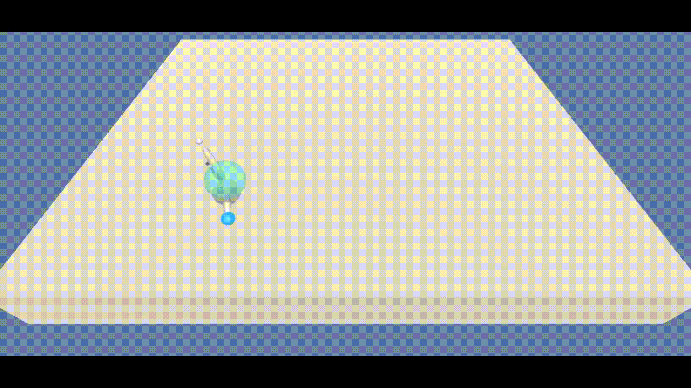

### Trained Agent

This agent was trained on ~300 episodes and managed to complete the environment, achieving an average score over 100 episodes of 31,23.


## **Learning Algorithm**

To solve this project an algorithm was implemented based on the <a href="https://arxiv.org/pdf/1509.02971.pdf"> DDPG - Deep Deterministic Policy Gradient</a> with some variations to fit the environment.

The network description itself along with the agent details, interpretation of obtained results and possible future work ideas are described in sections ahead.
  

## Implementation Details

- Actor-Critic

The agent has 2 main networks, a Actor and a Crtic with very simillar architectures, although their input and output is distinct.

In my implementation each trained network has a layout of two fully connected layers followed by another fully connected layer of 4 nodes, equal to the number of actions since it is the output layer. The first layer takes as input the environment which is a vector of length 33.

The Actor network takes as input the environment state and uses its network (policy) to output a vector of values representing the action to take (since we are using DDPG). 

Use that action on the environment and observe next state ```s'``` and the reward. 

Then the Critic takes as input the state and outputs the value for that state and does the same for the next state already received from the environment. 

These values are used to calculate the advantage function which is used to update/train the actor.

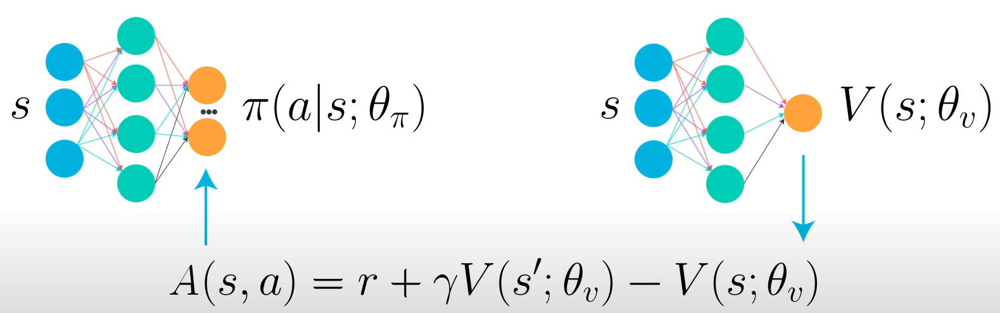


- Target Network

In normal learning, we update a guess with a guess, and this can potentially lead to harmful correlations.

To avoid this, we can update the weights in the network by predicting the values of the next states using a target network (different from the local network) and then calculating the loss using the mean squared average between these values and the values the local network expects. 

This loss is then used for the backpropagation step.

The target network is similar to the local network with the only difference being that the target network updates itself in a more slow and stable way than the local network (how slow/stable is controlled by tau's value).

This is done with the intent of the target being as stable as possible and to avoid problems derived from trying to chase a moving target.

There exists both a local and target network for the Actor and the Critic.

- Soft Update

Updates the target networks weights with the local network depending on the value of the hyperparameter tau ```τ```, tau ranges from 0 to 1.

When tau is close to 0 the target network stays is only slightly updated and when tau is close to 1 the target network becomes quite simillar to the local one. 

```
θ_target = τ*θ_local + (1 - τ)*θ_target
```

- Dropout Regularization

It randomly shutsdown the weight of the nodes based on a probability variable, it only affects trainning and dropout is not active when testing. If the probability is 20% then when making a guess on which action to take 20% of the network nodes if be randomly set to zero.

This technique is used to try to improve the models generalization and is used as a regularization technique since it reduces overfitting, much like adding noise to a network.

In this implementation dropout was only applied to the Actor's local and target netwrok'. 

Dropout regularization can be deactivated by changing dropout probability to zero.

- Batch Normalization

This technique is used on both the Actor and the Critic to normalize the values in each batch after passing the values through the first layer in order to try to reduce variance. 

Batch normalization can be activated or deactivated using a hyperparameter.

- Replay Memory 

The replay buffer contains a collection of past experience tuples (state,action,reward,next state,done).

The act of sampling a small batch of tuples from the replay buffer in order to learn is known as experience replay.

In addition to breaking harmful correlations, experience replay allows us to learn more from individual tuples multiple times, recall rare occurrences, and in general make better use of our experience.


- Optimizer

Adam Optimizer is used for the backpropagation step and gradient descent, this is one of the most used optimizers in the artificial intelligence community in general since it generates good results almost always.

- Ornstein-Uhlenbeck Noise

The OU noise purpose is to improve model generalization and adaptation since when used it adds noise to every action returned in training mode. 

This usually helps reduce overfitting but can slow down and difficult training as seen in the results section bellow.


## **Agent**

The Agent interacts with and learns from the environment.

It is given an initial state and decides which action is the best, then it observes which state derives from taking that action and gets the respective reward which is added to the score for that episode. 

These steps are repeated until the episode has finished. 

If the agent scores an average over 100 episodes equal or greater to the score goal of 30 it saves the actor and critic local network weights to files called `actor_checkpoint.pth` and `critic_checkpoint.pth`. 

The network's weights can be loaded from these files to test the model's performance and to see it act in the environment.

All training was done using a CPU only since the network only has Fully Connected layers so it would not benefit from any paralelism, thus the GPU would probably not significantly decrease training time. GPU would only be more relevant if the environment used to train was the Multi Agent environment since it features 20 Agents acting simultaneously.


## Hyperparameters

The agent receives a set of hyperparameters in its constructor which can be fine tuned in order to improve its performance.

```
=====
Agent
=====
gamma (int) : discount factor
tau (int) : for soft update of target parameter
lr_actor (int) : learning rate of the actor 
lr_critic (int) : learning rate of the critic 
weight_decay (int) : L2 weight decay  

============
Actor Critic
============
actor_fc1_units (int): Number of nodes in the Actor first hidden layer
actor_fc2_units (int): Number of nodes in the Actor second hidden layer
critic_fcs1_units (int): Number of nodes in the Critic first hidden layer
critic_fc2_units (int): Number of nodes in the Critic second hidden layer
batch_norm (bool): True to apply batch normalization
dropout_prob (float) : Dropout Regularization Probability on the Actor network - if 0 equals no dropout

=============
Replay Buffer
=============
buffer_size (int) : replay buffer size
batch_size (int) : minibatch size

========================
Ornstein-Uhlenbeck Noise
========================
add_ounoise (int) : Which episode to start using OU noise, if 0 starts from the beggining, if -1 never uses it
mu (float) : Ornstein-Uhlenbeck noise parameter
theta (float) : Ornstein-Uhlenbeck noise parameter
sigma (float) : Ornstein-Uhlenbeck noise parameter
```


## **Results**

The process decided for experimenting was to train each agent with different chosen hyperparameters for some episodes. Based on the results some agents were choosen to be trained for longer.

Using this process made it easier to test more hyperparameters values and as such to better learn which values would be better.

### 1. First Try With Intuitive Hyperparameters
```
Parameters: state_size=33 action_size=4 random_seed=0 actor_fc1_units=128 actor_fc2_units=128 critic_fcs1_units=128 critic_fc2_units=128 buffer_size=100000 batch_size=128 gamma=0.99 tau=0.001 lr_actor=0.0002 lr_critic=0.0002 weight_decay=0 
```


-  Train - 200 episodes

The model had difficulty learning and learned quite slow.

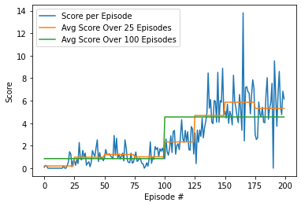


### 2. Batch Norm
```
Parameters: state_size=33 action_size=4 random_seed=0 actor_fc1_units=128 actor_fc2_units=128 critic_fc1_units=128 critic_fc2_units=128 buffer_size=100000 batch_size=128 gamma=0.99 tau=0.001 lr_actor=0.0002 lr_critic=0.0002 weight_decay=0 batch_norm=True 
```


- Train - 200 episodes

In these model batch normalization was added to try to make the grow more consistently however it still learned rather slowly and had a high variance.

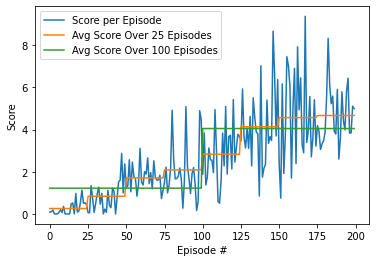

### 3. Higher Learning rate for Critic + #2
```
Parameters: state_size=33 action_size=4 random_seed=0 actor_fc1_units=128 actor_fc2_units=128 critic_fc1_units=128 critic_fc2_units=128 buffer_size=100000 batch_size=128 gamma=0.99 tau=0.001 lr_actor=0.0002 lr_critic=0.0005 weight_decay=0 batch_norm=True 
```


- Train - 100 episodes

This time the learning rate for the critic was increased to try to speed up learning, however the model still was not showing great progress.

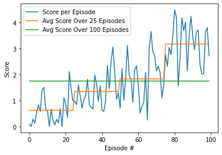

### 4. Removed OU Noise + #3

```
Parameters: state_size=33 action_size=4 random_seed=0 actor_fc1_units=128 actor_fc2_units=128 critic_fc1_units=128 critic_fc2_units=128 buffer_size=100000 batch_size=128 gamma=0.99 tau=0.001 lr_actor=0.0002 lr_critic=0.0005 weight_decay=0 batch_norm=True add_ounoise=False
```

- Train - 100 episodes

Since no model was making any progress, a decision was made to simplify the problem and to remove the OU Noise even if it meant possibly more overfitting.

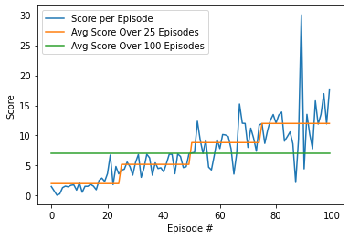

The results were promissing and as such the model was ran again on more episodes.

- Train - 300 episodes

The model showed great results although it had high variance. It learned quickly and managed to keep having good performances.

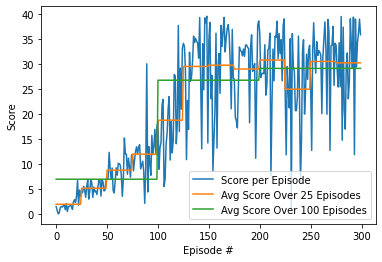


- Test

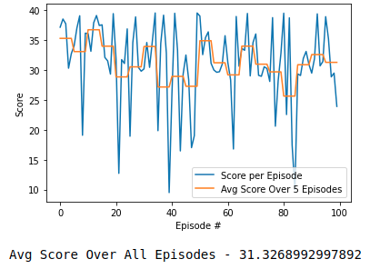

## **Succesfully Completed The Environment**

As seen above the model managed to complete the environment! Having an average score over 100 episodes bigger than 30.

Bellow is shown this model performing in the environment.


Despite having completed the environment my curiosity and ambition were still wishing for better and more stable results. 

As such a few other techniques were tested, although with not as much success as hoped. 

### 5. Dropout Regularization on the Actor + #4

When training and using dropout the results will have more variance since some key nodes might be shutdown on some instances, as such it can only be properly evaluated when testing.

```
Parameters: state_size=33 action_size=4 random_seed=0 actor_fc1_units=128 actor_fc2_units=128 critic_fc1_units=128 critic_fc2_units=128 buffer_size=100000 batch_size=128 gamma=0.99 tau=0.001 lr_actor=0.0002 lr_critic=0.0005 weight_decay=0 batch_norm=True add_ounoise=False mu=0.0 theta=0.15 sigma=0.2 dropout_prob=0.2
```


- Train - 300 episodes

Using dropout in training ended up increasing variance in training and lowering the average score over 100 episodes.

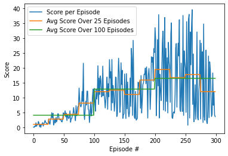


```
dropout_prob=0.15
```

- Train - 300 episodes

.png)


- Test - 300 episodes

The test results were what was most surprising since I expected them to have a lot lower variance and higher score than in trainning. 

.png)


In hindsight, the implementation of the dropout was probably not a great aproach since it will make the local and the target network greatly differ. The nodes being deactivated in each step in each network are not the same which makes the network chase a moving target. 

Maybe it would have been a better aproach to apply regularization only to the local network or to apply the shutdown to the exact same nodes between the local and the target network.

### 6. Smaller 2nd Layer + #4

```
Parameters: state_size=33 action_size=4 random_seed=0 actor_fc1_units=128 actor_fc2_units=64 critic_fc1_units=128 critic_fc2_units=64 buffer_size=100000 batch_size=128 gamma=0.99 tau=0.001 lr_actor=0.0002 lr_critic=0.0005 weight_decay=0 batch_norm=True add_ounoise=False mu=0.0 theta=0.15 sigma=0.2 dropout_prob=0.0 
```


This attempt was made to see if a simpler network could solve the environment as well as a more complex one

- Train

The results clearly show unpromissing evidences, having hoped for a steeper score ascent.

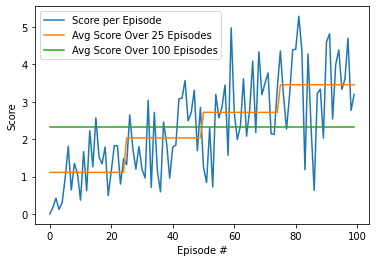


### 7. Added OU Noise After 150 Episodes + #3

```
Parameters: state_size=33 action_size=4 random_seed=0 actor_fc1_units=128 actor_fc2_units=128 critic_fc1_units=128 critic_fc2_units=128 buffer_size=100000 batch_size=128 gamma=0.99 tau=0.001 lr_actor=0.0002 lr_critic=0.0005 weight_decay=0 batch_norm=True add_ounoise=150 mu=0.0 theta=0.15 sigma=0.2 dropout_prob=0.0 
```

The idea behind applying OU Noise after the network had matured was to only try to reduce variance when its average score was higher. This way initial learning would not be affected by the noise.

- Train

 Unfortunatlly the training data graph was corrupted and lost so we can only acess the model after it has been trained for 300 episodes.

 - Test

 Having turned off the noise when testing, better results were hoped for. However it can be seen that adding noise to every action ended up confusing the networks trainning.

 Maybe an aproach where noise was only added to some actions based on a probability could help the model still learn properly while also reducing its variance.

 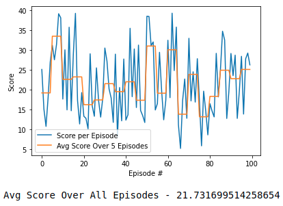


## **Future Work**

Possible modifications, experimentations or additions which could be made and explored to further try to improve our agent behaviour and consistency.

### Network

- Number of Layer and Nodes Variations

Experimentation with different number of layers and nodes in each layer could be made to try to create either a more powerfull or a lighter and simpler network. A more powerfull network (with more layers and nodes) would need more training time and the oposite for a lighter one.

- Input Pixels

The network could be changed to have convolutional layers to take as an input the environment pixels (which might need preprocessing such as grayscale, filters, etc.) instead of internal enviroment data.

In this scenario training with a GPU would be strongly recommended since convolutional layers take a lot of computation power and they can be heavily optimized using paralelism which the strong suit of the GPU.


### Learning Algorithm

- Prioritized Experience Replay - 

To deal with the huge variation in the obtained score by the model both when training and when testing a technique called Replay Priority could be enforced.

This technique replays some experiences with a higher priority, for example in the cases where they led to great results or to horrible ones, so as to replay important experiences more frequently, and therefore learn more efficiently and make less mistakes. This should probably help to reduce the variance in the attained score by the network, making it more consistent and faster to train. 

- Saving the Replay Memory

In addition to the weights of the network being saved when it achieves the desired score goal, the replay memory itself could also be saved to allow for further training of a previous network using its past experiences in addition to new ones.

- Dropout Regularization

As discussed before, dropout could be changed to apply regularization only to the local network or to apply the shutdown to the exact same nodes between the local and the target network. This way the local network would not be chassing a moving target.

In addition, dropout could also be implemented in the critic network if attention is given to the problem previously mentioned.

- Ornstein-Uhlenbeck Noise

As also discussed before in the results section, maybe an aproach where noise was only added to some actions based on a probability could help the model still learn properly while also reducing its variance. This could be implemented along side the current implementation which only starts adding the noise after the network has matured.

- Gradient Clipping

Like seen in the course classes gradient clipping can be a valuable technique to avoid the model getting stuck on a set of bad weights.


### Hyperparameter Values

Despite the exploration done, as shown in the results section, better hyperparameters could still be discovered in order to fine tune the model.

This is a struggle a lot of AI project always face since it is hard to know which values work best for each project.