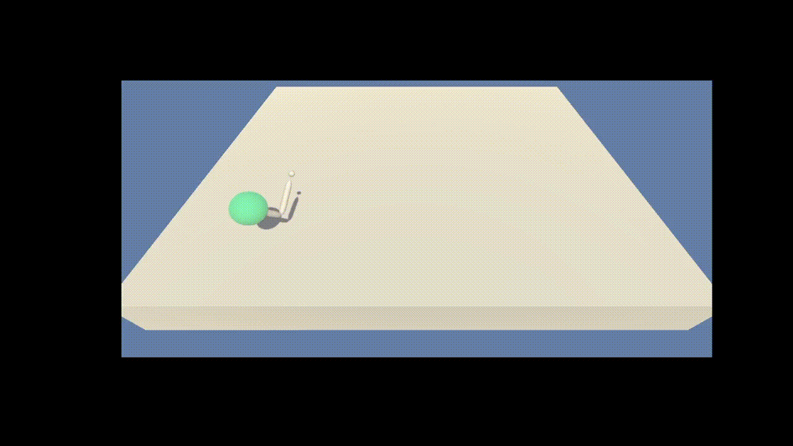

# Report Project 1 - Navigation

### <p style="text-align: center;">Miguel Carreira Neves</p>
<p style="text-align: center;">22/03/2022</p>

---

## **Introduction**

This report explains the implementation of the solution and all it's nuances. For a detailed explanation of the enviroment check the README.md file.

Only the 1st version of the enviroment was solved in this project, which means there was only one Agent training at any time as seen in the video bellow.

**TODO** insert video of random agent


## **Learning Algorithm**

To solve this project an algorithm was implemented based on the <a href="https://arxiv.org/pdf/1509.02971.pdf"> DDPG - Deep Deterministic Policy Gradient</a> with some variations to fit the enviroment.

The network description itself along with the agent details, interpretation of obtained results and possible future work ideas are described in sections ahead.
  

## Implementation Details

- Actor-Critic

The agent has 2 main networks, a Actor and a Crtic with very simillar architectures, although their input and output is distinct.

In my implementation each trained network has a layout of two fully connected layers followed by another fully connected layer of 4 nodes, equal to the number of actions since it is the output layer. The first layer takes as input the enviroment which is a vector of length 33.

The Actor network takes as input the enviroment state and uses its network (policy) to output a vector of values representing the action to take (since we are using DDPG). 

Use that action on the enviroment and observe next state ```s'``` and the reward. 

Then the Critic takes as input the state and outputs the value for that state and does the same for the next state already received from the enviroment. 

These values are used to calculate the advantage function which is used to update/train the actor.


- Target Network

In normal learning, we update a guess with a guess, and this can potentially lead to harmful correlations.

To avoid this, we can update the weights in the network by predicting the values of the next states using a target network (different from the local network) and then calculating the loss using the mean squared average between these values and the values the local network expects. 

This loss is then used for the backpropagation step.

The target network is similar to the local network with the only difference being that the target network updates itself in a more slow and stable way than the local network (how slow/stable is controlled by tau's value).

This is done with the intent of the target being as stable as possible and to avoid problems derived from trying to chase a moving target.

There exists both a local and target network for the Actor and the Critic.

- Soft Update

**TODO**

- Dropout Regularization

**TODO**

- Batch Normalization

**TODO**

- Replay Memory 

The replay buffer contains a collection of past experience tuples (state,action,reward,next state,done).

The act of sampling a small batch of tuples from the replay buffer in order to learn is known as experience replay.

In addition to breaking harmful correlations, experience replay allows us to learn more from individual tuples multiple times, recall rare occurrences, and in general make better use of our experience.


- Optimizer

Adam Optimizer is used for the backpropagation step and gradient descent, this is one of the most used optimizers in the artificial intelligence community in general since it generates good results almost always.

- Ornstein-Uhlenbeck Noise

The OU noise purpose is to improve model generalization and adaptation since when used it adds noise to every action returned in training mode. 

This usually helps reduce overfitting but can slow down and difficult training as seen in the results section bellow.


## **Agent**

The Agent interacts with and learns from the environment.

It is given an initial state and decides which action is the best, then it observes which state derives from taking that action and gets the respective reward which is added to the score for that episode. Epsilon is updated each episode based on the hyperparameters.

These steps are repeated until the episode has finished. 

If the agent scores an average over 100 episodes equal or greater to the score goal it saves the network weights in a file called `checkpoint.pth`.

Training was done using a CPU only since the network only has Fully Connected layers so it would not benefit from any paralelism, thus the GPU would probably not significantly decrease training time. GPU would only be more relevant if the enviroment used to train was the Multi Agent enviroment since it features 20 Agents acting simultaneously.


### Agent Behaviours

`act(self, state, eps=0.)`

The local Q Network is changed to evaluation mode based on the current state an action is choosen based the current policy using a epsilon greedy aproach.

`step(self, state, action, reward, next_state, done)`

It performs a step, potentially a learning step. An experience is saved into the Replay Memory and if enough steps have passed (based on a hyperparameter) the agent replays a random experience from memory and learns from it.

`learn(self, experiences, gamma)`

Changes local network to train mode and updates value parameters using a given batch of experience tuples (replay memory) and a discount factor.

It calculates the predicted maximum Q values for each next state using the target network and then uses these calculated values to find the value for each current state. 

Then the expected Q values for each state are also retrieved using the local network and the loss between the Q values of the local and the target is calculated (using the mean squared error).

This loss is then used for the backpropagation step along with the optimizer. 

Finally the network is updated using a soft update.

`soft_update(self, local_model, target_model, tau)`

Updates both the local and the target networks weights depending on the value of the hyperparameter tau.

## Hyperparameters

```
=====
Agent
=====
gamma (int) : discount factor
tau (int) : for soft update of target parameter
lr_actor (int) : learning rate of the actor 
lr_critic (int) : learning rate of the critic 
weight_decay (int) : L2 weight decay  

============
Actor Critic
============
actor_fc1_units (int): Number of nodes in the Actor first hidden layer
actor_fc2_units (int): Number of nodes in the Actor second hidden layer
critic_fcs1_units (int): Number of nodes in the Critic first hidden layer
critic_fc2_units (int): Number of nodes in the Critic second hidden layer
batch_norm (bool): True to apply batch normalization
dropout_prob (float) : Dropout Regularization Probability on the Actor network - if 0 equals no dropout

=============
Replay Buffer
=============
buffer_size (int) : replay buffer size
batch_size (int) : minibatch size

========================
Ornstein-Uhlenbeck Noise
========================
add_ounoise (int) : Which episode to start using OU noise, if 0 starts from the beggining, if -1 never uses it
mu (float) : Ornstein-Uhlenbeck noise parameter
theta (float) : Ornstein-Uhlenbeck noise parameter
sigma (float) : Ornstein-Uhlenbeck noise parameter
```


## Results

The process decided for experimenting was to train each agent with different chosen hyperparameters for some episodes. Based on the results some agents were choosen to be trained for longer.

Using this process made it easier to test more hyperparameters values and as such to better learn which values would be better.

1. 1st Try
```
DDPG called with params: state_size=33 action_size=4 random_seed=0 actor_fc1_units=128 actor_fc2_units=128 critic_fcs1_units=128 critic_fc2_units=128 buffer_size=100000 batch_size=128 gamma=0.99 tau=0.001 lr_actor=0.0002 lr_critic=0.0002 weight_decay=0 
```


2. Batch Norm
```
DDPG called with params: state_size=33 action_size=4 random_seed=0 actor_fc1_units=128 actor_fc2_units=128 critic_fc1_units=128 critic_fc2_units=128 buffer_size=100000 batch_size=128 gamma=0.99 tau=0.001 lr_actor=0.0002 lr_critic=0.0002 weight_decay=0 batch_norm=True 
```


3. Higher Learning rate for Critic + #2
```
DDPG called with params: state_size=33 action_size=4 random_seed=0 actor_fc1_units=128 actor_fc2_units=128 critic_fc1_units=128 critic_fc2_units=128 buffer_size=100000 batch_size=128 gamma=0.99 tau=0.001 lr_actor=0.0002 lr_critic=0.0005 weight_decay=0 batch_norm=True 
```


4. Removed OU Noise + #3 -> **Candidate to Full Train**


```
DDPG called with params: state_size=33 action_size=4 random_seed=0 actor_fc1_units=128 actor_fc2_units=128 critic_fc1_units=128 critic_fc2_units=128 buffer_size=100000 batch_size=128 gamma=0.99 tau=0.001 lr_actor=0.0002 lr_critic=0.0005 weight_decay=0 batch_norm=True add_ounoise=False
```


**300 episodes**

- Train


- Test


**Succesfully Compleated The Enviroment**



5. Dropout Regularization on the Actor + #4

```
DDPG called with params: state_size=33 action_size=4 random_seed=0 actor_fc1_units=128 actor_fc2_units=128 critic_fc1_units=128 critic_fc2_units=128 buffer_size=100000 batch_size=128 gamma=0.99 tau=0.001 lr_actor=0.0002 lr_critic=0.0005 weight_decay=0 batch_norm=True add_ounoise=False mu=0.0 theta=0.15 sigma=0.2 dropout_prob=0.2
```


dropout_prob=0.15

.png)


- Test

dropout_prob=0.15

.png)

6. Smaller 2nd Layer + #4

```
DDPG called with params: state_size=33 action_size=4 random_seed=0 actor_fc1_units=128 actor_fc2_units=64 critic_fc1_units=128 critic_fc2_units=64 buffer_size=100000 batch_size=128 gamma=0.99 tau=0.001 lr_actor=0.0002 lr_critic=0.0005 weight_decay=0 batch_norm=True add_ounoise=False mu=0.0 theta=0.15 sigma=0.2 dropout_prob=0.0 
```


### Conclusions


## **Future Work**

Possible modifications, experimentations or additions which could be made and explored to further try to improve our agent behaviour and consistency.

### Q Network

- Number of Layer and Nodes Variations

Experimentation with different number of layers/nodes in each layer could be made to try to create either a more powerfull or a lighter and simpler network. A more powerfull network (with more layers and nodes) would need more training time and the oposite for a lighter one.

- Input Pixels

The network could be changed to have convolutional layers to take as an input the enviroment pixels (which might need preprocessing such as grayscale, etc.) instead of in-game data.

In this scenario training with a GPU would be strongly recommended since convolutional layers take a lot of computation power and they can be heavily optimized using paralelism which the strong suit of the GPU.


### Learning Algorithm

- Prioritized Experience Replay - 

To deal with the huge variation in the obtained score by the model both when training and when testing a technique called Replay Priority could be enforced.

This technique replays some experiences with a higher priority, for example in the cases where they led to great results or to horrible ones, so as to replay important experiences more frequently, and therefore learn more efficiently and make less mistakes. This should probably help to reduce the variance in the attained score by the network, making it more consistent. 

- Saving the Replay Memory

In addition to the weights of the network being saved when it achieves the desired score goal, the replay memory itself could also be saved to allow for further training of a previous network using its past experiences in addition to new ones.

- DDQN (Double Deep Q Network)

Double Q-learning can make estimation more robust by selecting the best action using one set of parameters *W*, but evaluating it using a different set of parameters *W'*. Since we already have a second network (the target network), this implementation would not be to difficult, neither would it weight significantly more computationally.

### Hyperparameter Values

These values were choosen based on what the scientific community usually agrees are the best, however they can be changed using trial and error to improve model performance and decrease training time.