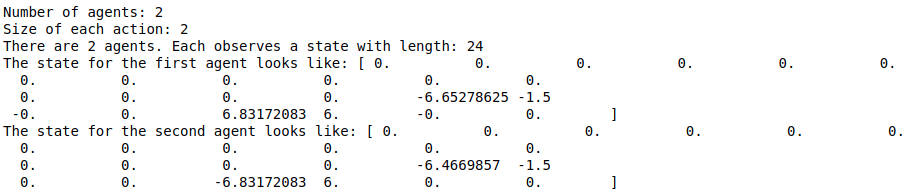
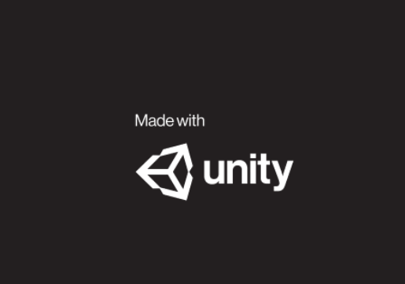

# Project 3: Collaboration and Competition

### Introduction

For this project, you will work with the [Tennis](https://github.com/Unity-Technologies/ml-agents/blob/master/docs/Learning-Environment-Examples.md#tennis) environment.


In this environment, two agents control rackets to bounce a ball over a net. If an agent hits the ball over the net, it receives a reward of +0.1.  If an agent lets a ball hit the ground or hits the ball out of bounds, it receives a reward of -0.01.  Thus, the goal of each agent is to keep the ball in play.

The observation space consists of 8 variables corresponding to the position and velocity of the ball and racket. Each agent receives its own, local observation.  Two continuous actions are available, corresponding to movement toward (or away from) the net, and jumping. 

The task is episodic, and in order to solve the environment, your agents must get an average score of +0.5 (over 100 consecutive episodes, after taking the maximum over both agents). Specifically,

- After each episode, we add up the rewards that each agent received (without discounting), to get a score for each agent. This yields 2 (potentially different) scores. We then take the maximum of these 2 scores.
- This yields a single **score** for each episode.

The environment is considered solved, when the average (over 100 episodes) of those **scores** is at least +0.5.

Example of an Action: 

Action values can vary between -1 and 1
```
[0.5, -1]
```

Example of the enviroment State:



---
## Report

Read the <a href="./Report.md">Report.md</a> file to see all the implementation details and the results obtained along side future work ideas.

---


## Getting Started

A version of Python Python <= 3.6 must be used in order for the environment to be properly visualized.

Unity Agents, mlagents, PyTorch and numpy must be installed:
```
pip install unityagents

python -m pip install mlagents==0.28.0

pip install torch

pip install numpy
```
The solution was made using a jupyter notebook so it must be installed as well to be ran:
```
pip install jupyter
```
---

## How to Run

Clone this repository and open a terminal on its location.

Run on the terminal.

```
jupyter notebook
```

 It should then open a jupyter notebook file tree in the browser, then select `ContinuousControl.ipynb` and the notebook should be opened in another browser window.

In that new window click on the option `Cell` followed by `Run All` and if all dependencies are properly installed the notebook should start running successfully.

A Unity window like the one bellow will pop up.




Then go back to the notebook (without closing it) and choose whether you want to train the network or load it from a file and see it perform. 
Only then should you `Alt-Tab` into the Unity window to see it starting to train or perform in test mode.


## Relevant Links

https://www.udacity.com/course/deep-reinforcement-learning-nanodegree--nd893
