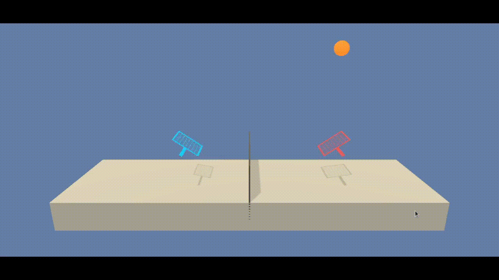
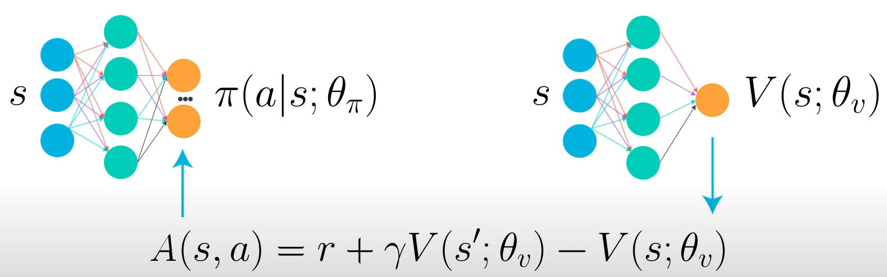

# Report Project 3 - Collaboration and Competition

### <p style="text-align: center;">Miguel Carreira Neves</p>
<p style="text-align: center;">22/03/2022</p>

---

## **Introduction**

This report explains the implementation of the solution present in the Jupyter Notebook file called <a href="./Tennis.ipynb">Tennis.ipynb</a>.

For a detailed explanation of the environment check the README.md file.

Due to the nature of the enviroment and how the reward function is designed, the **enviroment rewards cooperation** between the players. 

This is because the episode ends when the ball hits the floor or is out of bounds, consequently no matter how good a player is if the "bad" player drops the ball both players scores will be damaged because the good player's score will be capped that episode.

## **Agent**

The Agent interacts with and learns from the environment. To solve this enviroment only one agent is used and he portrays as both players through self-play.

It is given an initial state and decides which action is the best, then it observes which state derives from taking that action and gets the respective reward which is added to the score for that episode. 

These steps are repeated until the episode has finished. 

If the agent scores an average over 100 episodes equal or greater to the score goal of ```0,5``` it saves the actor and critic local network weights to files called `actor_checkpoint.pth` and `critic_checkpoint.pth`. 

The network's weights can be loaded from these files to test the model's performance and to see it act in the environment.

All training was done using a CPU only since the network only has Fully Connected layers so it would not benefit from any paralelism, thus the GPU would probably not significantly decrease training time.

### Random Agent

A agent which acts randomly manages to consistently get a score between ```0``` and ```0,1```, this serves as a baseline to compare the trained agent with. 



### Trained Agent

This agent was trained on ~800 episodes and managed to complete the environment, achieving an average score over 100 episodes of ```2,169```.


---

## **Learning Algorithm**

To solve this project an algorithm was implemented based on the <a href="https://arxiv.org/pdf/1509.02971.pdf"> DDPG - Deep Deterministic Policy Gradient</a> with some variations to fit the environment.

The network description itself along with the agent details, interpretation of obtained results and possible future work ideas are described in sections ahead.
  

## Implementation Details

- Self-Play

The enviroment features two players, however both when trainning and testing only one agent was used. 

This agent would play against itself and receive the enviroment state of the first player and act accordingly and then would do the same for the other player. Thus only one set of actor and critic networks exist and are updated.

This allowed trainning to be much smoother since the agent was not dependent on another network playing incorrectly which meant it couldn't get as much score in that episode and it might have handicapped it's learning. 

It also meant trainning was faster since twice the ammount of experiences were collected through the "scope" of each player.

- Actor-Critic

The agent has 2 main networks, a Actor and a Crtic with very simillar architectures, although their input and output is distinct.

In my implementation each trained network has a layout of two fully connected layers followed by another fully connected layer of 4 nodes, equal to the number of actions since it is the output layer. The first layer takes as input the environment which is a vector of length 33.

The Actor network takes as input the environment state and uses its network (policy) to output a vector of values representing the action to take (since we are using DDPG). 

Use that action on the environment and observe next state ```s'``` and the reward. 

Then the Critic takes as input the state and outputs the value for that state and does the same for the next state already received from the environment. 

These values are used to calculate the advantage function which is used to update/train the actor.




- Target Network

In normal learning, we update a guess with a guess, and this can potentially lead to harmful correlations.

To avoid this, we can update the weights in the network by predicting the values of the next states using a target network (different from the local network) and then calculating the loss using the mean squared average between these values and the values the local network expects. 

This loss is then used for the backpropagation step.

The target network is similar to the local network with the only difference being that the target network updates itself in a more slow and stable way than the local network (how slow/stable is controlled by tau's value).

This is done with the intent of the target being as stable as possible and to avoid problems derived from trying to chase a moving target.

There exists both a local and target network for the Actor and the Critic.

- Soft Update

Updates the target networks weights with the local network depending on the value of the hyperparameter tau ```τ```, tau ranges from 0 to 1.

When tau is close to 0 the target network stays is only slightly updated and when tau is close to 1 the target network becomes quite simillar to the local one. 

```
θ_target = τ*θ_local + (1 - τ)*θ_target
```

- Batch Normalization

This technique is used on both the Actor and the Critic to normalize the values in each batch after passing the values through the first layer in order to try to reduce variance. 

Batch normalization can be activated or deactivated using a hyperparameter.

- Replay Memory 

The replay buffer contains a collection of past experience tuples (state,action,reward,next state,done).

The act of sampling a small batch of tuples from the replay buffer in order to learn is known as experience replay.

In addition to breaking harmful correlations, experience replay allows us to learn more from individual tuples multiple times, recall rare occurrences, and in general make better use of our experience.


- Optimizer

Adam Optimizer is used for the backpropagation step and gradient descent, this is one of the most used optimizers in the artificial intelligence community in general since it generates good results almost always.

- Gradient Clipping

To try to reduce overshooting when doing the gradient ascent the gradient is clipped, thus taking a more conservative approach to updating our networks. This means they might need more time to learn but that they should be more stable.

- Ornstein-Uhlenbeck Noise

The OU noise purpose is to improve model generalization and adaptation since when used it adds noise to every action returned in training mode. 

This usually helps reduce overfitting but can slow down and difficult training as seen in the results section bellow.


## Hyperparameters

The agent receives a set of hyperparameters in its constructor which can be fine tuned in order to improve its performance.

```
=====
Agent
=====
gamma (int) : discount factor
tau (int) : for soft update of target parameter
lr_actor (int) : learning rate of the actor 
lr_critic (int) : learning rate of the critic 
weight_decay (int) : L2 weight decay  

============
Actor Critic
============
actor_fc1_units (int): Number of nodes in the Actor first hidden layer
actor_fc2_units (int): Number of nodes in the Actor second hidden layer
critic_fcs1_units (int): Number of nodes in the Critic first hidden layer
critic_fc2_units (int): Number of nodes in the Critic second hidden layer
batch_norm (bool): True to apply batch normalization
gradient_clip : True to apply gradient clipping

=============
Replay Buffer
=============
buffer_size (int) : replay buffer size
batch_size (int) : minibatch size

========================
Ornstein-Uhlenbeck Noise
========================
add_ounoise (int) : Which episode to start using OU noise, if 0 starts from the beggining, if -1 never uses it
mu (float) : Ornstein-Uhlenbeck noise parameter
theta (float) : Ornstein-Uhlenbeck noise parameter
sigma (float) : Ornstein-Uhlenbeck noise parameter
```

---

## **Results**

The process decided for experimenting was to train each agent with different chosen hyperparameters for some episodes. Based on the results some agents were choosen to be trained for longer.

Using this process made it easier to test more hyperparameters values and as such to better learn which values would be better.

### 1. First Try With Intuitive Hyperparameters

These parameters were selected using the same parameters from the previous project - <a href="../Project2-ContinuousControl/ContinuousControl.ipynb">Continuous Control</a>
```
Parameters: state_size=state_size action_size=action_size  random_seed=0 actor_fc1_units=128  actor_fc2_units=128 critic_fc1_units=128  critic_fc2_units=128 buffer_size=int(1e5)  batch_size=128 gamma=0.99  tau=1e-3  lr_actor=2e-4  lr_critic=5e-4  weight_decay=0  batch_norm=True add_ounoise=-1
```

-  Train - 777 episodes

The model had difficulty learning for the first 600 episodes, however it then proceeded to learn at an astonishing rate peaking at ```2,5``` score and getting an average score over 100 episodes of about **1,2**.

Thus it managed to succesfully complete the enviroment

.png)

-  Test - 100 episodes

## **Succesfully Completed The Environment**

.png)

Testing this model returned amazing results achieving an average score over 100 episodes of **2,169** and managing to get near the teoretical max score of ~```2,5``` for the given timesteps (by never dropping the ball).

-  Train - 200 more episodes (total of 977)

Having solved the enviroment, curiosity derived further experimentation and so, the agent was trained on 200 more episodes.

.png)

The agent's score oscilated a lot between never dropping the ball and dropping it almost instantly. Interestingly, after ~100 episodes the agent score plummeted to ```0``` and never managed to recover.


### 2. Smaller Neural Networks and learning rates

In order to try to avoid overshooting when trying to do gradient ascent and falling into a recoverless zone, learning rates for both the actor and the critic were lowered. 

Also, since before there was such a use burst of score from one moment to the other it lead me to believe that a more simpler solution could be found which is the number of neurons in each layer were diminuished.

```
Parameters: state_size=state_size action_size=action_size  random_seed=0  actor_fc1_units=64  actor_fc2_units=64 critic_fc1_units=128  critic_fc2_units=128 buffer_size=int(1e5)  batch_size=128 gamma=0.99  tau=1e-3  lr_actor=1e-4  lr_critic=2e-4  weight_decay=0 batch_norm=True  add_ounoise=-1
```

-  Train - 850 episodes

.png)

As expected the learning was a bit more stable, not having dropped to ```0``` after sometime. 

However it is still observed specially by the orange line that the model skyrocketed in its score and its best and most consistent performance was just after that ascent, having dropped significantly after.

Having solved the enviroment again and with a smaller network, it suggests that maybe a even smaller network could be used, maybe even one with just one hidden layer.


-  Test - 100 episodes

## **Succesfully Completed The Environment**

.png)

Despite these results not being as impressive as the previous ones the agent still managed to solve the enviroment although its obtainned score had high variance.

### 3. Gradient Clipping

Trying to continue solving the overshooting problem this technique we learned in the lessons was applied.

-  Train - 700 episodes

.png)

-  Test - 100 episodes

.png)


---

## **Future Work**

Possible modifications, experimentations or additions which could be made and explored to further try to improve our agent behaviour and consistency.

### Network

- Number of Layer and Nodes Variations

Experimentation with different number of layers and nodes in each layer could be made to try to create either a more powerfull or a lighter and simpler network. A more powerfull network (with more layers and nodes) would need more training time and the oposite for a lighter one.

- Input Pixels

The network could be changed to have convolutional layers to take as an input the environment pixels (which might need preprocessing such as grayscale, filters, etc.) instead of internal enviroment data.

In this scenario training with a GPU would be strongly recommended since convolutional layers take a lot of computation power and they can be heavily optimized using paralelism which the strong suit of the GPU.


### Learning Algorithm

- Prioritized Experience Replay - 

To deal with the huge variation in the obtained score by the model both when training and when testing a technique called Replay Priority could be enforced.

This technique replays some experiences with a higher priority, for example in the cases where they led to great results or to horrible ones, so as to replay important experiences more frequently, and therefore learn more efficiently and make less mistakes. This should probably help to reduce the variance in the attained score by the network, making it more consistent and faster to train. 

- Saving the Replay Memory

In addition to the weights of the network being saved when it achieves the desired score goal, the replay memory itself could also be saved to allow for further training of a previous network using its past experiences in addition to new ones. This could speed up training by a lot since much of the time is spent gathering experiences.

- Ornstein-Uhlenbeck Noise

Maybe an aproach where noise was only added to some actions based on a probability could help the model still learn properly while also reducing its variance. This could be implemented along side the current implementation which only starts adding the noise after the network has matured.

- Gradient Clipping

Like seen in the course classes gradient clipping can be a valuable technique to avoid the model getting stuck on a set of bad weights.

### Hyperparameter Values

Despite the exploration done, as shown in the results section, better hyperparameters could still be discovered in order to fine tune the model.

This is a struggle a lot of AI project always face since it is hard to know which values work best for each project.