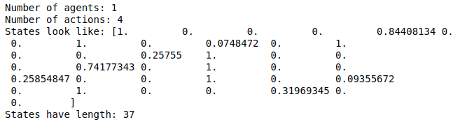
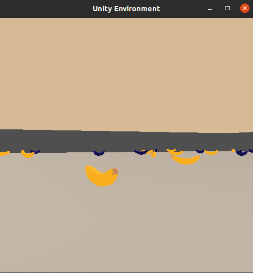

# Udacity Deep RL Nanodegree Project 1 - Navigation

### <p style="text-align: center;">Miguel Carreira Neves</p>
<p style="text-align: center;">22/03/2022</p>

---

## Project Details

For this project, an agent was trained to navigate (and collect bananas!) in a large, square world. Its goal is to collect as many yellow bananas as possible in each episode while avoiding blue bananas.


Actions: Forward, Backwards, Left, Right

The state space has 37 dimensions and contains the agent's velocity, along with ray-based perception of objects around the agent's forward direction.



A reward of +1 is provided for collecting a yellow banana, and a reward of -1 is provided for collecting a blue banana. Thus, the goal of your agent is to collect as many yellow bananas as possible while avoiding blue bananas.

The task is episodic and it is considered to be solved when an average score of 13 or above is achieved across 100 consecutive episodes.


## Getting Started

A version of Python Python <= 3.6 must be used in order for the enviroment to be properly visualized.

Unity Agents, mlagents, PyTorch and numpy must be installed:
```
pip install unityagents

python -m pip install mlagents==0.28.0

pip install torch

pip install numpy
```
The solution was made using a jupyter notebook so it must be installed as well to be ran:
```
pip install jupyter
```
---

## How to Run

Clone this repository and open a terminal on its location.

Run on the terminal.

```
jupyter notebook
```

 It should then open a jupyter notebook file tree in the browser, then select `Navigation.ipynb` and the notebook should be opened in another browser window.

In that new window click on the option `Cell` followed by `Run All` and if all dependencies are properly installed the notebook should start running successfully.

A Unity window like the one bellow will pop up.


Then go back to the notebook (without closing it) and choose whether you want to train the network or load it from a file and see it perform. 
Only then should you `Alt-Tab` into the Unity window to see it starting to train or perform in test mode.



## Relevant Links

https://www.udacity.com/course/deep-reinforcement-learning-nanodegree--nd893